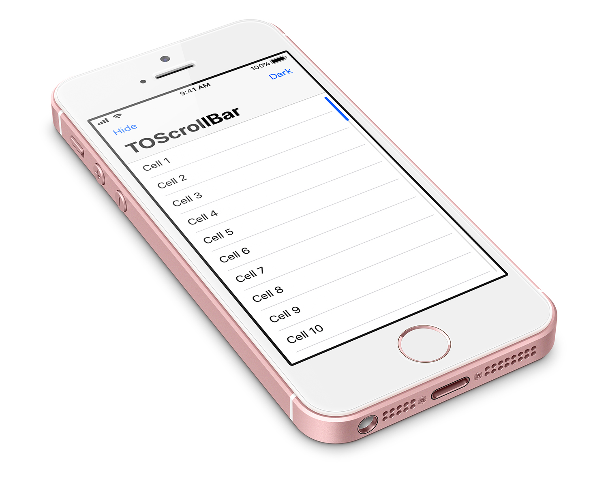

# TOScrollBar



[](http://api.travis-ci.org/TimOliver/TOScrollBar.svg)
[](https://cocoapods.org/pods/TOScrollBar)
[](http://cocoadocs.org/docsets/TOScrollBar)
[](https://raw.githubusercontent.com/TimOliver/TOScrollBar/master/LICENSE)
[](http://cocoadocs.org/docsets/TOScrollBar)
[](https://beerpay.io/TimOliver/TOScrollBar)
[](https://www.paypal.com/cgi-bin/webscr?cmd=_s-xclick&hosted_button_id=M4RKULAVKV7K8)

`TOScrollBar` is a UI component that can be inserted into `UIScrollView` instances, allowing the user to traverse the entire scroll view in one swiping gesture.

It has been designed to appear and behave like a standard system control, and has been optimized to ensure it has minimal impact on scroll performance.

# Features

* Allows for fine-grained scrolling of a `UIScrollView`'s entire content height.
* Interoperates directly with `UIScrollView` through the Objective-C runtime and KVO.
* Animates the same way as the standard scroll indicators (including rubber banding).
* Exposes 44 points of horizontal touch space, so it is very easy to activate.
* Tapping at different positions allows for instant traversal along the scroll view.
* Plays a scrolling animation during slow swiping, making it easier to follow along.
* Comes with initial style settings for dark themes.
* Includes Taptic Engine impact effects in a similar style to `UISlider`, available on iPhone 7.

# Examples

`TOScrollBar` has been designed to be added directly to a `UIScrollView`, not as a view above.

```objc

// Create a scroll bar object
TOScrollBar *scrollBar = [[TOScrollBar alloc] init];

// Add the scroll bar to our table view
[self.tableView to_addScrollBar:scrollBar];

//Adjust the table separators so they won't underlap the scroll bar
self.tableView.separatorInset = [self.tableView.to_scrollBar adjustedTableViewSeparatorInsetForInset:self.tableView.separatorInset];

```

Once added to a scroll view, a scroll bar can be accessed via the `to_scrollBar` property. Convienience methods are
also applied to make it easier to configure the margins


# Installation

`TOScrollBar` will work with iOS 7 and above. While written in Objective-C, it should easily import into Swift as well.

## Manual Installation

Copy the contents of the `TOScrollBar` folder to your app project.

## CocoaPods

```
pod 'TOScrollBar'
```

## Carthage

Feel free to file a PR. :)

# Why build this?

I'm building a [comic reader app](http://icomics.co) that allows users to group collections of comics into single view controllers.

Unfortunately, some users have reported that certain comic series have a very large number of issues. It doesn't make sense to break these issues out
of their collections, but at the same time, traversing the comic has become a gruelling process.

This scroll bar is the first component in a series of upgrades I'm planning in an attempt to make navigation large comic collections more manageable.

# Credits

`TOScrollBar` was created by [Tim Oliver](http://twitter.com/TimOliverAU) as a component of [iComics](http://icomics.co).

# License

`TOScrollBar` is available under the MIT license. Please see the [LICENSE](LICENSE) file for more information. 
